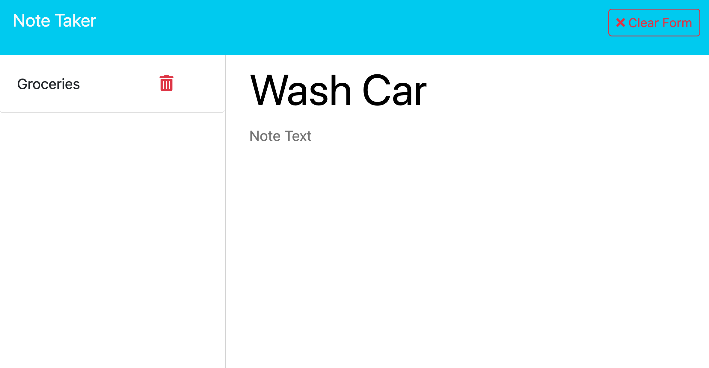

# Note Taker
  

## Description 
    This note taker app can be used to easily write and save notes. It uses express.js for backend. 
## Table of Contents
- [Installation](#installation)
- [Usage](#usage)
- [License](#license)
- [Questions](#questions)
## Installation
    Start the server by entering "node server.js" in the command line. This will start the application in localhost port 3003. Navigate to localhost:3003 in order to see the application.
## Usage
    On the welcome page, press the "Get Started" button. Enter your note title and note text and press "save note" in order to save the note to the left of the application. Note that you can clear your note if you would like to start over, and you can delete notes pressing the appropriate buttons on the top right of the application. 
## License
The license for this project is MIT
https://opensource.org/license/mit/

    
## Questions
  Contact me at benita.isaac@gmail.com if you have any other questions. Github: 
[https://github.com/benitaisaac](https://github.com/benitaisaac)